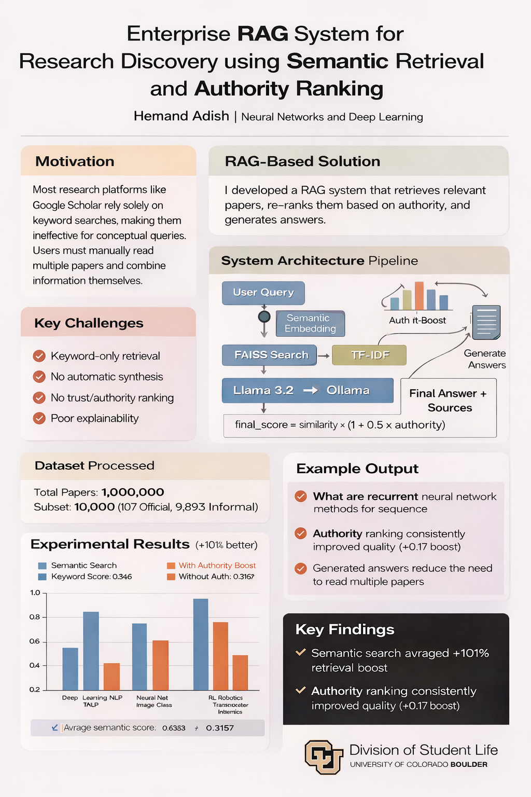

# ResearchMind-An-Authority-Aware-RAG-System-for-Semantic-Academic-Discovery

ResearchMind is an end-to-end Retrieval-Augmented Generation (RAG) system built to improve how users search, understand, and interact with academic research papers. Instead of relying only on keyword-based matching, the system uses semantic retrieval, authority-aware ranking, and large language model generation to provide grounded answers from a research paper collection.

This project was developed as part of the **Neural Network and Deep Learning** course.


## Motivation

Traditional research platforms often depend heavily on keyword-based search. This works well only when users already know the exact terms they want to search for. In practice, researchers and students usually think in broader concepts, not precise keywords. Because of this, many relevant papers can be missed when the wording in the document differs from the wording in the query.

Another challenge is that most search systems only return a list of documents. Users still have to open multiple papers, read abstracts, compare findings, and manually combine the information to answer their question. This process is slow, inefficient, and difficult for exploratory research.

ResearchMind was designed to address these problems by combining semantic search, authority-based ranking, and answer generation into one unified research assistant.

## Problem Statement

The project aims to solve four major limitations in traditional academic search systems:

1. Keyword dependency makes it difficult to retrieve papers for conceptual or vague queries.
2. Search engines return documents, not synthesized answers.
3. Retrieved papers are often ranked only by relevance, without considering source quality or authority.
4. Many AI-based systems lack transparency in showing why certain results were selected.

## Proposed Solution

ResearchMind introduces an authority-aware RAG pipeline for academic discovery. The system takes a natural language query, retrieves semantically relevant papers using dense embeddings and FAISS, compares the results with traditional TF-IDF keyword search, re-ranks the retrieved results using an authority-aware scoring formula, and finally generates a grounded answer using a local large language model through Ollama.

The ranking formula used is:

final_score = cosine_similarity * (1 + 0.5 * authority)

This helps the system not only retrieve relevant documents, but also prioritize higher-quality and more reliable sources.

## Key Features

- Semantic search using `all-mpnet-base-v2`
- FAISS-based dense retrieval
- TF-IDF keyword search baseline for comparison
- Authority-aware re-ranking
- Grounded answer generation using `llama3.2` through Ollama
- Streamlit-based interactive chat dashboard
- Transparent display of top source papers and ranking scores
- Comparison of semantic search vs keyword search performance

## System Architecture

The workflow of the system is:

User Query  
→ Query Embedding using SentenceTransformer  
→ Semantic Retrieval using FAISS  
→ Keyword Retrieval using TF-IDF  
→ Authority-Aware Re-ranking  
→ Top-k Paper Selection  
→ Prompt Construction  
→ LLM Generation with Ollama  
→ Final Answer with Sources

## Dataset

The project is based on a large academic paper collection containing approximately **1,000,000 papers**. For experimentation, a subset of **10,000 papers** was processed and indexed.

Within this subset:
- Official research papers: 107
- Informal research papers: 9,893

This imbalance reflects realistic data conditions and motivates the need for authority-aware ranking.

## Experimental Results

### 1. Semantic Search vs Keyword Search

The system was tested on multiple conceptual research queries. Semantic retrieval consistently outperformed traditional keyword-based search.

- Average Semantic Score: **0.6346**
- Average Keyword Score: **0.3157**
- Improvement: **101.0%**

This result shows that semantic retrieval is much better at capturing meaning and intent than lexical matching alone.

### 2. Impact of Authority Ranking

Authority-based ranking improved the final retrieval quality by boosting more reliable and official papers.

- Average authority boost: **+0.1698**

This demonstrates that combining semantic similarity with authority information produces more trustworthy results.

## Example Queries

Some example questions tested on the system include:

- How is reinforcement learning being used in modern AI research?
- What are the main challenges in explainable artificial intelligence?
- What are recurrent neural network methods for sequence modeling?
- How are graph neural networks used in scientific research?

## Demo
[Watch the demo video](demo.mp4)

## Example Output

For a query such as:

**What are recurrent neural network methods for sequence modeling?**

The system retrieves top relevant papers, including:
- Multi-Dimensional Recurrent Neural Networks
- Risk Assessment Algorithms Based on Recursive Neural Networks
- A Neural Network Approach to Ordinal Regression

It then generates a grounded response summarizing how recurrent neural networks are used for sequence tasks and how extensions such as MDRNN expand their applicability to areas like vision, video processing, and medical imaging.

## Tech Stack

- Python
- FAISS
- SentenceTransformers
- scikit-learn
- TF-IDF Vectorizer
- Ollama
- Llama 3.2
- Streamlit
- Pandas
- NumPy

## Project Structure

```bash
├── app.py
├── arxiv_faiss_index.bin
├── arxiv_metadata.pkl
├── requirements.txt
├── notebooks/
├── data/
└── README.md

# Clone the repository
git clone https://github.com/your-username/researchmind-rag.git
cd researchmind-rag

# Create virtual environment
python -m venv venv

# Activate environment
# Windows:
venv\Scripts\activate
# Mac/Linux:
# source venv/bin/activate

# Install dependencies
pip install -r requirements.txt

# Install FAISS (if needed)
pip install faiss-cpu

# Install and setup Ollama (download from https://ollama.com first)

# Pull model
ollama pull llama3.2

# Start Ollama server
ollama serve

# Run the application
streamlit run app.py

# Open in browser
# http://localhost:8501
